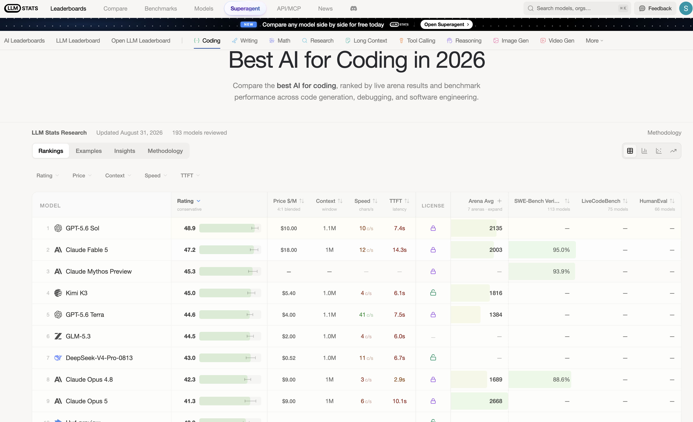

# Approach

Step by step record of how I worked through this problem.
Results in the README.

---

## Step 1: Reading the problem

**Doing:** Defining the task from the problem statement.

**Reasoning:**
- DB already exists and is the source of truth, so the feature is a
  translation problem, not a computation one. Task is text to SQL.
- Rejected loading match data into context: model arithmetic can be
  confidently wrong, costs more, and risks numbers that disagree with the
  rest of the site. 400 token budget fits a schema, not data.
- Model owns schema comprehension and valid SQL. It does not own data
  accuracy or arithmetic. So correctness has to be measured on returned
  rows, not on query text, since two different queries can both be right.
- Priority from constraints: correctness first, cost as a hard ceiling,
  latency as a tiebreaker.

**Gaps:** query volume unspecified, no concrete schema or DB yet, traffic
shape unknown.

**Output:** Task is text to SQL. Decision rule is drop anything over
budget, pick the most accurate of the rest, latency breaks ties.


## Step 2: Fixing the prompt and doing the cost math

**Doing:** Locking the exact request that will go to every model, then turning the constraints into a price ceiling I can filter a leaderboard with.

### The prompt

System and schema are identical on every call. Only the question changes.

```
SYSTEM:
You are a text-to-SQL generator. Given a database schema and a question,
return a single SQL query that answers it. Use SQLite syntax.
Return only the SQL query.

USER:
Schema:
CREATE TABLE "matches" (
  "id" INTEGER, "season" TEXT, "city" TEXT, "date" TIMESTAMP,
  "match_type" TEXT, "player_of_match" TEXT, "venue" TEXT,
  "team1" TEXT, "team2" TEXT, "toss_winner" TEXT, "toss_decision" TEXT,
  "winner" TEXT, "result" TEXT, "result_margin" REAL, "target_runs" REAL,
  "target_overs" REAL, "super_over" TEXT, "method" TEXT,
  "umpire1" TEXT, "umpire2" TEXT
);
CREATE TABLE "deliveries" (
  "match_id" INTEGER, "inning" INTEGER, "batting_team" TEXT,
  "bowling_team" TEXT, "over" INTEGER, "ball" INTEGER, "batter" TEXT,
  "bowler" TEXT, "non_striker" TEXT, "batsman_runs" INTEGER,
  "extra_runs" INTEGER, "total_runs" INTEGER, "extras_type" TEXT,
  "is_wicket" INTEGER, "player_dismissed" TEXT, "dismissal_kind" TEXT,
  "fielder" TEXT
);

Question: Which bowler has the best economy rate among bowlers who bowled
at least 500 legal balls? Economy is runs conceded per over (six legal
balls). Exclude wides and no-balls from the ball count. Give the bowler
and the economy.
```

Expected output shape:

```sql
SELECT bowler,
       6.0 * SUM(total_runs) /
       SUM(CASE WHEN extras_type IS NULL
                  OR extras_type NOT IN ('wides', 'noballs')
                THEN 1 ELSE 0 END) AS economy
FROM deliveries
GROUP BY bowler
HAVING SUM(CASE WHEN extras_type IS NULL
                  OR extras_type NOT IN ('wides', 'noballs')
                THEN 1 ELSE 0 END) >= 500
ORDER BY economy ASC
LIMIT 1;
```

**Reasoning:** Two tables plus an instruction is a small, fixed prefix, so input size does not vary with the question. That makes the token count predictable enough to budget against. It also means every model is judged on identical input, so accuracy differences come from the model and not the prompt.

### Inputs to the math

| Item | Value |
|---|---|
| Input | ~400 tokens per question |
| Output | ~100 tokens per question |
| Volume | ~50,000 questions per day in season |
| Budget | 5000 USD per month |

### Monthly volume

- 50,000 x 30 = **1.5M questions per month**
- Input: 1.5M x 400 = **600M tokens**
- Output: 1.5M x 100 = **150M tokens**
- Total: **750M tokens per month**

### Ceilings

- Per question: 5000 / 1.5M = **$0.0033 per question**
- Blended, treating all tokens at one price: 5000 / 750M = **$6.67 per million tokens**

Input and output are priced separately, so the real filter is:

```
600 * P_in + 150 * P_out <= 5000
```

Dividing by 150 gives a one line rule to apply to any leaderboard row, with prices in USD per million tokens:

```
4 * P_in + P_out <= 33.3
```

Worked example: if a model prices output at 4x input, this reduces to 8 * P_in <= 33.3, so input must be at or under **$4.17 per million**.

**Output:** A hard price filter to apply during shortlisting, plus the observation that input tokens are 80 percent of monthly volume, so input price dominates the bill.


## Step 3: Choosing a leaderboard

**Doing:** Finding a leaderboard to shortlist candidates from.

Started with the obvious choice, text to SQL benchmarks:

- **Spider** (Yale), the original cross domain one. Closed to new submissions since Feb 2024.
- **Spider 2.0**, enterprise scale. 1000+ column schemas, BigQuery and Snowflake.
- **BIRD-SQL**, 12k question and SQL pairs across 95 databases.
- **WikiSQL**, superseded.

Dropped all of them:

- The top entries are not plain models. They are full systems that add extra steps around the model, like picking relevant tables first or generating several queries and voting on the best one. I need a single model answering a single prompt, so their scores do not apply to me.
- Many of the listed models are fine tuned versions built for the benchmark. I cannot call those through an API.
- These leaderboards only rank accuracy. They do not show price or speed, and those are two of my three constraints.
- The difficulty does not match my case. Spider 2.0 uses databases with over 1000 columns, while mine has two tables and 37 columns. A score there tells me little about my schema.

So I used a coding leaderboard instead. Writing SQL is a coding task, so general coding ability is a reasonable signal here. These leaderboards are updated regularly. The models on them are public ones I can call through an API. They also list price and speed, which I need for the cost filter from step 2.

**Chose:** llm-stats.com, Best AI for Coding.

**Output:** a candidate pool with accuracy, price and speed for each model.

