# LLM Model Evaluation: Text to SQL

Picking the right LLM for a natural language cricket stats feature, by filtering a leaderboard on cost and then running a custom eval on the finalists.

Repo: https://github.com/Spador/llm-model-eval

---

## The problem

A cricket statistics website wants users to type questions in plain English instead of clicking through filters.

> How many sixes did Virat Kohli hit in the last 4 seasons?
> Which bowler took the most wickets in the 2023 season?

The answer has to come from the match database the site already maintains, and it has to be the same number the site shows everywhere else.

### Constraints given

| Constraint | Value |
|---|---|
| Budget | $5,000 per month |
| Volume | ~50,000 questions per day |
| Correctness | Highest priority. Fans screenshot stats and post them |
| Latency | Matters, lowest weight |

### The task

Convert a natural language question into SQL against a known schema. The database executes the query and returns the number, so the model never touches the data or does arithmetic. Then find the model that does this best inside the budget.

---

## Approach

Three stages: turn the constraints into a price ceiling, use a leaderboard to narrow the field, then run a custom eval to decide.

```mermaid
flowchart LR
    subgraph P1[" 1 · REQUIREMENTS "]
        direction TB
        A[Read the problem<br/>task is text to SQL] --> B[Fix the prompt<br/>~400 in / ~100 out]
        B --> C[Token math<br/>750M tokens per month<br/>cap = $6.67 per M]
    end

    subgraph P2[" 2 · SHORTLIST "]
        direction TB
        D[Pick a leaderboard<br/>SQL benchmarks rejected<br/>use llm-stats coding board] --> E[Fetch all models<br/>rating · price · speed]
        E --> F[Normalize and rank<br/>0.9 rating + 0.1 speed]
        F --> G[Apply price cap<br/>6 candidates]
    end

    subgraph P3[" 3 · CUSTOM EVAL "]
        direction TB
        H[Build database<br/>IPL 2021-2024] --> I[Extract schema<br/>into the prompt]
        I --> J[Golden dataset<br/>20 questions + gold SQL]
        J --> K[Smoke test<br/>+ verify slugs]
        K --> L[Evaluator<br/>execution accuracy]
        L --> M[Eval loop<br/>6 models x 20 questions]
    end

    C ==> D
    G ==> H
    M ==> N[Winner<br/>Claude Sonnet 5<br/>19/20 · $3,750 per month]

    classDef step fill:#1e293b,stroke:#64748b,stroke-width:1px,color:#f1f5f9
    classDef gate fill:#fbbf24,stroke:#b45309,stroke-width:2px,color:#1c1917
    classDef win fill:#10b981,stroke:#047857,stroke-width:2px,color:#052e16
    classDef phase fill:#0f172a,stroke:#475569,stroke-width:1px,color:#94a3b8

    class A,B,D,E,F,H,I,J,K,L,M step
    class C,G gate
    class N win
    class P1,P2,P3 phase
```



Full walkthrough with reasoning at each step: **[APPROACH.md](APPROACH.md)**

---

## Cost math

Token sizes are not given in the problem. I estimated them by writing out several representative prompts and their expected SQL outputs and averaging: roughly **400 tokens in** (instruction + schema + question) and **100 tokens out** (a single query). The schema is fixed at 84 words, so input size barely varies with the question.

```
tokens per request = 400 + 100 = 500
requests per month = 50,000 x 30 = 1,500,000
tokens per month   = 750M

price cap = 5000 / 750 = $6.67 per million tokens
```

These estimates also produce a 4:1 input to output ratio, which happens to match the 4:1 blend the leaderboard prices at, so the cap applies to the listed price directly with no conversion.

This removes the top of the leaderboard. GPT-5.6 Sol at $10/M, Claude Fable 5 at $18/M, and Claude Opus 4.8 at $9/M all break the budget at this volume.

---

## Candidates

Six models inside the cap, spread across labs and countries rather than taken straight off the top of the ranking.

| Model | Org | Blended $/M | Monthly cost |
|---|---|---|---|
| GPT-5.6 Terra | OpenAI | 4.00 | $3,000 |
| Kimi K3 | Moonshot AI | 5.40 | $4,050 |
| DeepSeek-V4-Pro-0813 | DeepSeek | 0.52 | $390 |
| Qwen3.8 Max | Alibaba | 2.00 | $1,500 |
| Grok 4.6 | xAI | 2.00 | $1,500 |
| Claude Sonnet 5 | Anthropic | 5.00 | $3,750 |

---

## The eval

**Dataset:** IPL 2021 to 2024 from Kaggle, trimmed to 279 matches and 67,303 deliveries in SQLite.

**Golden dataset:** 20 questions, 8 hard and 12 brutal, with reference SQL and frozen results. Deliberately a stress tier, since simple lookups would not separate frontier models.

**Metric:** execution accuracy. Both queries run against the real database and the returned data is compared. Column names ignored, numbers compared numerically, row order ignored unless the question demands it. Two very different queries can both be correct, so comparing query text would be wrong.

---

## Results

```
Claude Sonnet 5        19/20  =  95.0%
Grok 4.6               18/20  =  90.0%
GPT-5.6 Terra          15/20  =  75.0%
Kimi K3                14/20  =  70.0%
DeepSeek-V4-Pro-0813   13/20  =  65.0%
Qwen3.8 Max             9/20  =  45.0%
```

### Winner: Claude Sonnet 5

Most accurate model inside the budget, at $3,750 a month against a $5,000 ceiling. Produced executable SQL on all 20 questions and did not degrade as the questions got harder.

### Findings

- **The leaderboard did not predict the winner.** Sonnet 5 ranked 14th and Grok 4.6 ranked 12th on the coding leaderboard, yet they finished first and second. The highest ranked candidate, GPT-5.6 Terra at 4th, came fourth here.
- **US models took the top three, Chinese models the bottom three.** A clean split that the ranking did not anticipate.
- **Failure modes differ more than the scores.** US models mostly wrote runnable SQL returning wrong data. Chinese models mostly returned nothing, likely truncated by the 800 token cap.
- **Every model failed question 10**, which points at the question or the gold answer rather than the models.

### Limitations

- 20 questions is a small sample, and the gap between first and second is one question
- Gold SQL was drafted by Claude Opus 5, not a human expert, so a bias toward Sonnet 5 cannot be ruled out
- Empty responses may be a `max_tokens` artifact rather than model capability
- Single run at temperature 0, so no variance measured
- Hard tier only, so these numbers are not comparable to public leaderboard scores

---

## Repo contents

| Path | What it does |
|---|---|
| `src/fetch_leaderboard.py` | Pulls model stats from the llm-stats API |
| `src/rank_models.py` | Normalizes rating and speed, computes the combined score |
| `src/db.py` | Builds the SQLite database from the Kaggle CSVs |
| `src/schema_extractor.py` | Dumps the schema and prints value domains |
| `src/golden_dataset_generator.py` | The 20 questions with reference SQL |
| `src/make_golden_dataset.py` | Executes gold SQL and freezes results to CSV |
| `src/first_test.py` | Single call smoke test against OpenRouter |
| `src/model_openrouter_slug.py` | The six candidates as OpenRouter slugs |
| `src/check_slugs.py` | Verifies every slug is live before a run |
| `src/evaluator.py` | Result set comparison logic |
| `src/main.py` | The eval loop |
| `data/` | Database, schema, leaderboard, golden dataset |
| `results/eval_results.csv` | One row per model per question |

---

## Reproducing

```bash
git clone https://github.com/Spador/llm-model-eval.git
cd llm-model-eval

python3.12 -m venv .venv
source .venv/bin/activate
pip install -r requirements.txt

cp .env.example .env
# add OPENROUTER_API_KEY and LLM_STATS_API_KEY
```

Put the Kaggle IPL CSVs in `data/raw/`, then:

```bash
python src/fetch_leaderboard.py      # pull leaderboard data
python src/rank_models.py            # rank and shortlist
python src/db.py                     # build the database
python src/schema_extractor.py       # extract schema
python src/golden_dataset_generator.py   # validate gold SQL
python src/make_golden_dataset.py    # freeze gold results
python src/check_slugs.py            # verify slugs are live
python src/main.py                   # run the eval
```

The full eval is 120 API calls, roughly $0.25 on OpenRouter.

---

## Credits

**Leaderboard data:** [LLM Stats](https://llm-stats.com). Model ratings, pricing, and speed were fetched through their [Stats API](https://llm-stats.com/developer), specifically the [Best AI for Coding](https://llm-stats.com/leaderboards/best-ai-for-coding) leaderboard.

**Dataset:** IPL complete dataset from Kaggle, trimmed to the 2021 to 2024 seasons.

**Inference:** All models were called through [OpenRouter](https://openrouter.ai).

**Method:** Follows the CampusX LLM evaluation course and the reference implementation at [campusx-official/llm-sql-eval](https://github.com/campusx-official/llm-sql-eval). The candidate selection, cost analysis and findings here are my own.